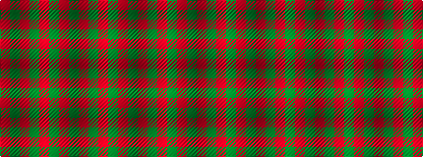

GRGRGRGRGR

It is a 10 stripe tartan.

<figure class="pat-woven">

<figcaption>idealised sample</figcaption>
</figure>

## Colour Sequence



## Tartans with this colour sequence

This pattern is a design lineage: every tartan below shares one colour order, whatever its owner —
near-identical designs are grouped, the largest lineage first (#112: the pattern is a tartan's
second parent, beside its family or clan).

<table class="sett-table">
<tbody>
<tr><td><a href="/variants/s10/r8g2r2g6r1g6r2g2r8y1/">Bruce</a></td></tr>
<tr><td class="sett-swatch"></td></tr>
<tr><td><a href="/variants/s6/r29g2r2g2r6dy21~x4/">Maguire Clan Family Tartan</a></td></tr>
<tr><td class="sett-swatch"></td></tr>
<tr class="cluster-sep"><td></td></tr>
<tr><td><a href="/variants/s10/r24g2r2g40r25g2r2g2r2g20~x2/">Donachie</a></td></tr>
<tr><td class="sett-swatch"></td></tr>
<tr><td><a href="/variants/s10/g14r4g2r2g2r4g19r30g2r9~x2/">Livingstone</a></td></tr>
<tr><td class="sett-swatch"></td></tr>
</tbody>
</table>

