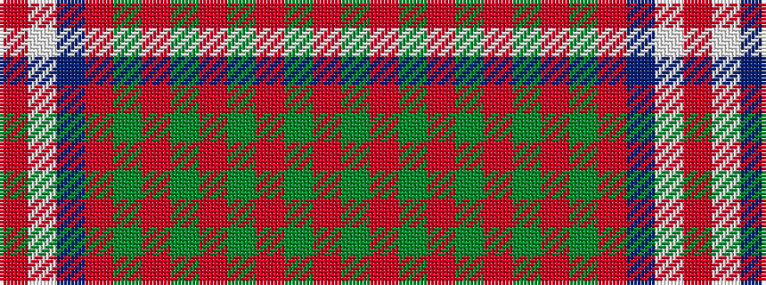

GRGRGRGRGRBWR

It is a 13 stripe tartan.

<figure class="pat-woven">

<figcaption>idealised sample</figcaption>
</figure>

## Colour Sequence



## Tartans with this colour sequence

| Tartans |
|---------------|
| [Hans, Jaswinder (Personal)](/variants/s13/g2ri1g30r1g3r1g10o9g2r5db3w1r1~x2/)|
||
