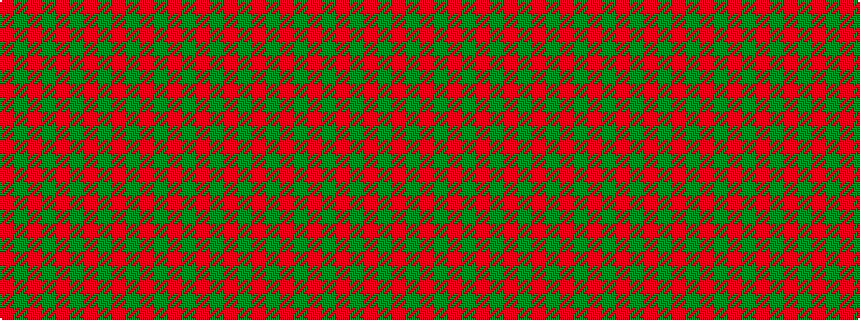

GRGRGRGRGRGRGR

It is a 14 stripe tartan.

<figure class="pat-woven">

<figcaption>idealised sample</figcaption>
</figure>

## Colour Sequence



## Tartans with this colour sequence

| Tartans |
|---------------|
| [Kyle (Green)](/variants/s14/r54g6r5g6r10g3r2g18~x2/)|
||
| [Robertson #2](/variants/s14/dg15r1dg1r1dg1r18dg24r1dg1r18dg1r1dg1r3~x2/)|
||
| [Robertson - 1746 (Artefact)](/variants/s14/g15r1g1r1g1r18g24r1g1r18g1r1g1r3~x2/)|
||
