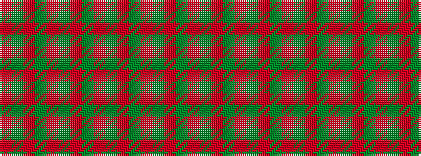

GRGRGRGRGRGRGRGRGR

It is a 18 stripe tartan.

<figure class="pat-woven">

<figcaption>idealised sample</figcaption>
</figure>

## Colour Sequence



## Tartans with this colour sequence

| Tartans |
|---------------|
| [Donachie Clan Tartan](/variants/s18/r24g2r2g40r25g2r2g2r2g20~x2/)|
||
