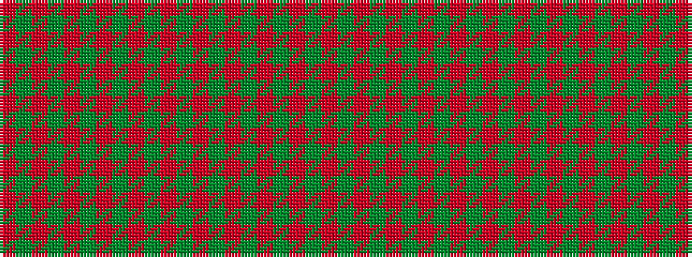

GRGRGRGRGRGRGRGRGRGR

It is a 20 stripe tartan.

<figure class="pat-woven">

<figcaption>idealised sample</figcaption>
</figure>

## Colour Sequence



## Tartans with this colour sequence

| Tartans |
|---------------|
| [MacIntosh, Ancient](/variants/s20/r5y1r2g4r3g2r2y5r5g1r1g2r1g1r1g4r1g1r1g2~x2/)|
||
