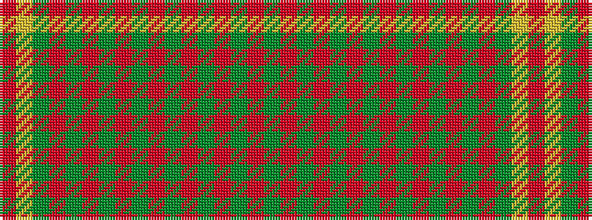

GRGRGRGRGRGRGRGYR

It is a 17 stripe tartan.

<figure class="pat-woven">

<figcaption>idealised sample</figcaption>
</figure>

## Colour Sequence



## Tartans with this colour sequence

| Tartans |
|---------------|
| [Hebrides Outer](/variants/s17/g9r2g3r20g2r1g2r2g20r2g3r2g2r22g3ly1r3~x2/)|
||
