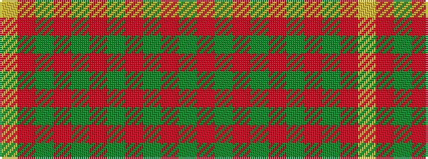

GRGRGRGRGRY

It is a 11 stripe tartan.

<figure class="pat-woven">

<figcaption>idealised sample</figcaption>
</figure>

## Colour Sequence



## Tartans with this colour sequence

| Tartans |
|---------------|
| [MacRea / MacRae](/setts/s11/dg22r4dg22r22dg2r3dg2r3dg2r3ly2~x2/)|
||
| [MacRea ? MacRae](/setts/s11/g22r4g22r22g2r3g2r3g2r3ly2~x2/)|
||
