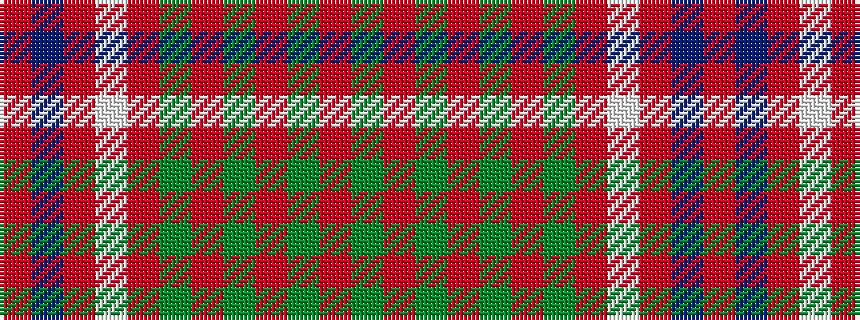

GRGRGRGRWRBR

It is a 12 stripe tartan.

<figure class="pat-woven">

<figcaption>idealised sample</figcaption>
</figure>

## Colour Sequence



## Tartans with this colour sequence

| Tartans |
|---------------|
| [MacRae](/setts/s12/g21r5g21r21g5r4g5r21w4r5db21r4/)|
||
| [MacRae (Sample)](/setts/s12/dg21r5dg21r21dg5r4dg5r21w4r5db21r4/)|
||
