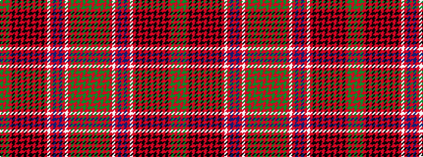

GRGRGRGRWRBRBRWRKRKRKRKRKRKRGRG

It is a 31 stripe tartan.

<figure class="pat-woven">

<figcaption>idealised sample</figcaption>
</figure>

## Colour Sequence



## Tartans with this colour sequence

| Tartans |
|---------------|
| [Kinnoull](/variants/s31/g23r6g23r25g4r10g4r25w3r10b31r6b31r10w3r25k2r2k4r2k2r25k2r2k4r2k2r25g23r6g23~x2/)|
||
