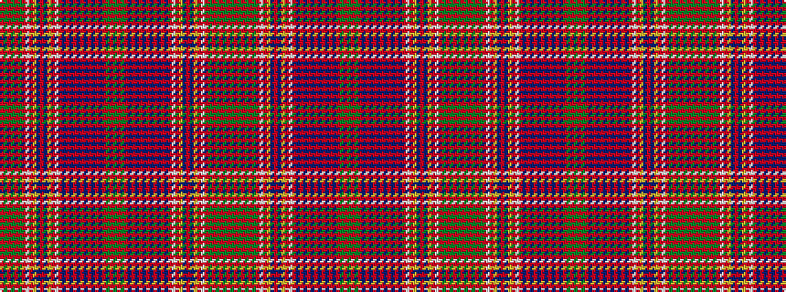

GRGRGRGRWRYBRBYRWRBRBRBRBRBRBRGRGRGRBRBRBRBRBRBRWRYBRBYRWRGRGRGR

It is a 64 stripe tartan.

<figure class="pat-woven">

<figcaption>idealised sample</figcaption>
</figure>

## Colour Sequence



## Tartans with this colour sequence

| Tartans |
|---------------|
| [Huntly](/variants/s64/dg8r2dg8r12dg2r3dg2r12w1r3ly1dp12r3dp12ly1r3w1r12dp1r1dp2r1dp1r12dp1r1dp2r1dp1r12dg8r2dg8~x2/)|
||
