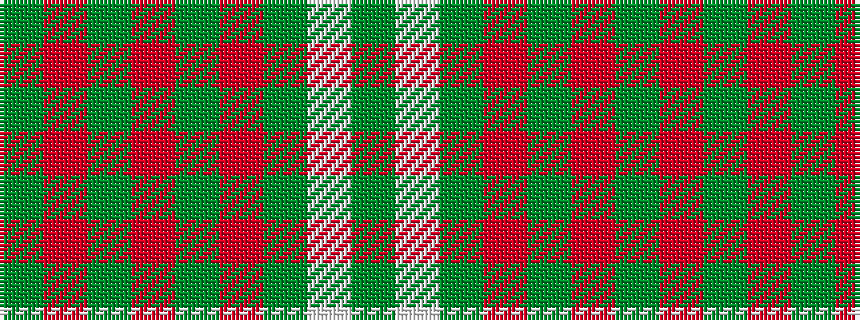

GRGRGRGWG

It is a 9 stripe tartan.

<figure class="pat-woven">

<figcaption>idealised sample</figcaption>
</figure>

## Colour Sequence



## Tartans with this colour sequence

| Tartans |
|---------------|
| [Red Dirt Girl](/variants/s9/dy21r2g18r2g18r2dg8w6dy10~x2/)|
||
