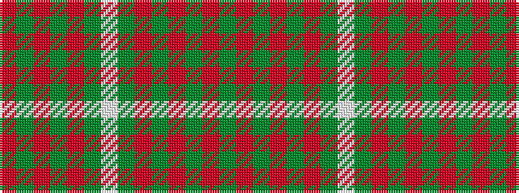

GRGRGRGWGRGRGR

It is a 14 stripe tartan.

<figure class="pat-woven">

<figcaption>idealised sample</figcaption>
</figure>

## Colour Sequence



## Tartans with this colour sequence

| Tartans |
|---------------|
| [Leeds, University of (Dance) #1](/setts/s14/g34m4g4m4g4m12g20w5~x2/)|
||
