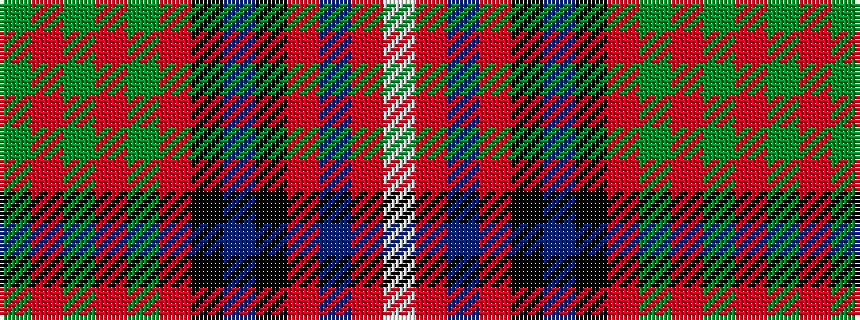

GRGRGRKBKRBRW

It is a 13 stripe tartan.

<figure class="pat-woven">

<figcaption>idealised sample</figcaption>
</figure>

## Colour Sequence



## Tartans with this colour sequence

| Tartans |
|---------------|
| [Canadian Estate](/variants/s13/g18r1g2r2g16r1k16n1k2r2db20r1lb2~x4/)|
||
