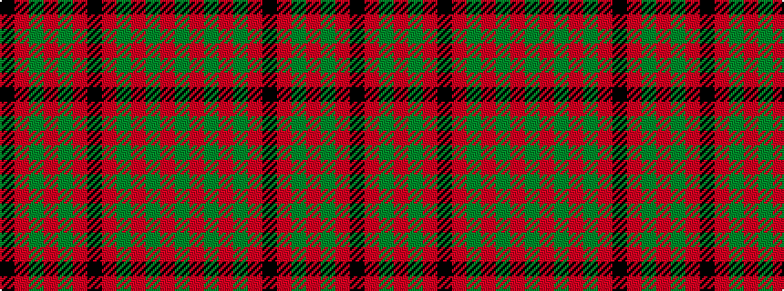

GRGRGRKRGRGRK

It is a 13 stripe tartan.

<figure class="pat-woven">

<figcaption>idealised sample</figcaption>
</figure>

## Colour Sequence



## Tartans with this colour sequence

| Tartans |
|---------------|
| [MacQuarrie #4](/variants/s13/k1r1dg1r21dg1r1k10r1dg14r1dg1r1dg1~x2/)|
||
| [MacQuarrie 6](/variants/s13/k1r1g1r21g1r1k10r1g14r1g1r1g1~x2/)|
||
