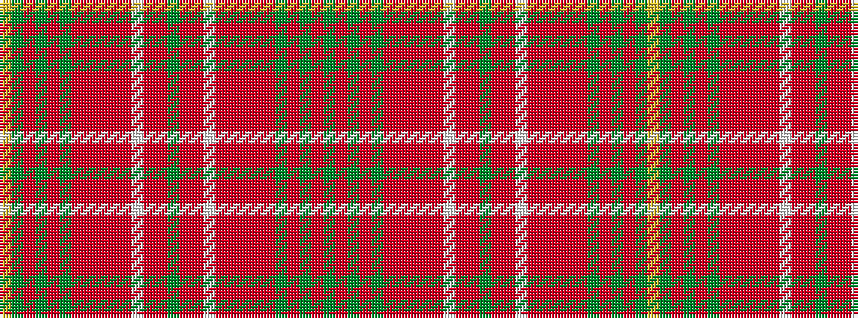

GRGRGRRRRRWRRGRRWRRRRRGRGRGY

It is a 28 stripe tartan.

<figure class="pat-woven">

<figcaption>idealised sample</figcaption>
</figure>

## Colour Sequence



## Tartans with this colour sequence

| Tartans |
|---------------|
| [Jewel Look JTB](/variants/s28/g4o2r4w3r4o4r6m21o4g2o2g20o4g2ly4/)|
||
