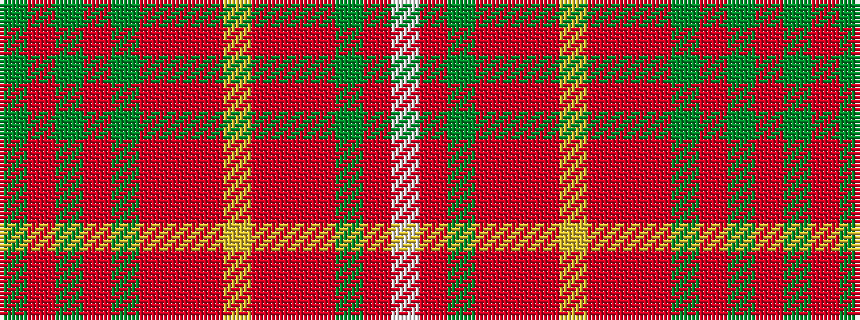

GRGRGRRRYRRRGRW

It is a 15 stripe tartan.

<figure class="pat-woven">

<figcaption>idealised sample</figcaption>
</figure>

## Colour Sequence



## Tartans with this colour sequence

| Tartans |
|---------------|
| [Prince Edward Island](/variants/s15/g16o1g2o1g2o12r12o1ly2o1r12o12g12o1w2~x2/)|
||
