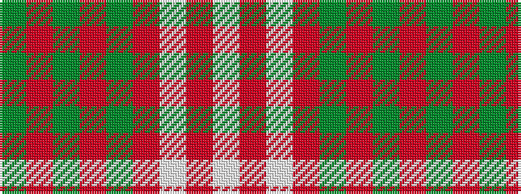

GRGRGRWRW

It is a 9 stripe tartan.

<figure class="pat-woven">

<figcaption>idealised sample</figcaption>
</figure>

## Colour Sequence



## Tartans with this colour sequence

| Tartans |
|---------------|
| [Lindsay Dress Red](/variants/s9/dg26r3dg3r3dg3r11w27r3w5~x2/)|
||
| [Lindsay, dress Red](/variants/s9/g26r3g3r3g3r11w27r3w5~x2/)|
||
