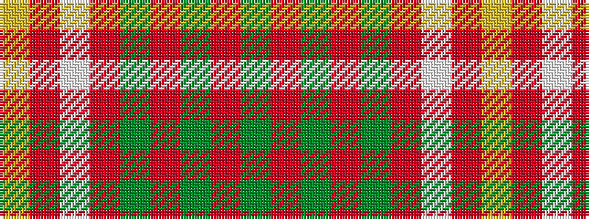

GRGRGRWRY

It is a 9 stripe tartan.

<figure class="pat-woven">

<figcaption>idealised sample</figcaption>
</figure>

## Colour Sequence



## Tartans with this colour sequence

| Tartans |
|---------------|
| [Prince Edward Island, Dress](/variants/s9/g22r2g4r2g4r18w24r1lo3~x2/)|
||
