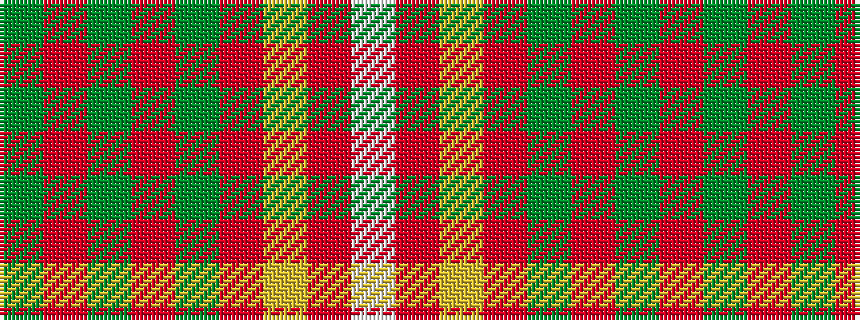

GRGRGRYRW

It is a 9 stripe tartan.

<figure class="pat-woven">

<figcaption>idealised sample</figcaption>
</figure>

## Colour Sequence



## Tartans with this colour sequence

| Tartans |
|---------------|
| [Royal Pharmaceutical Society](/variants/s9/dy3o2dg19o6dg2o6lo14r4w2~x2/)|
||
| [Royal Pharmaceutical Society (Corp)](/variants/s9/dy2o2dg19o6dg2o6lo14r4w2~x2/)|
||
