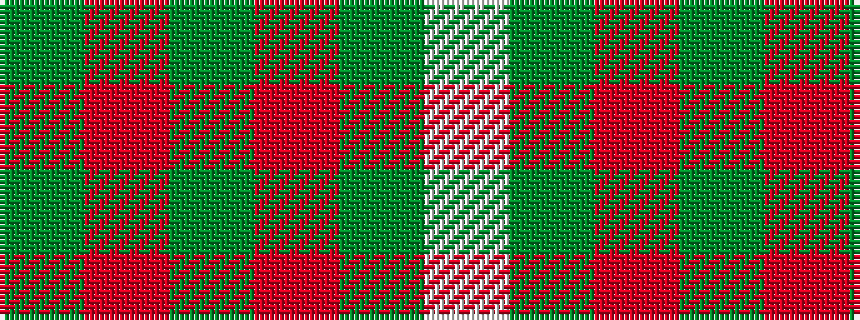

GRGRGW

It is a 6 stripe tartan.

<figure class="pat-woven">

<figcaption>idealised sample</figcaption>
</figure>

## Colour Sequence



## Tartans with this colour sequence

| Tartans |
|---------------|
| [Dewi Sant](/setts/s6/dg30r2dg8r1dg5w2/)|
||
| [St. David's Welsh District Tartan Tartan Number: 5746. Earliest known date: 2002 Representing the colours of Wales, this national tartan is recognised in Wales as The Brithwe Dewi Sant, or The Saint Davids Tartan, exclusively woven in Wales by The Cambrian Woollen Mill, in Llanwrtyd Wells, Powys. Launched at Cardiff Castle in honour of the Welsh Patron Saint, and worn by Welsh folk around the world for special occasions including St Davids Day, March 1st. A differing warp and weft create a vertical stripe in these Welsh Tartans. See products available Copyright © Blair Urquhart, Comrie, 2015](/setts/s6/dg60r2dg8r1dg5w2/)|
|![St. David's Welsh District Tartan Tartan Number: 5746. Earliest known date: 2002 Representing the colours of Wales, this national tartan is recognised in Wales as The Brithwe Dewi Sant, or The Saint Davids Tartan, exclusively woven in Wales by The Cambrian Woollen Mill, in Llanwrtyd Wells, Powys. Launched at Cardiff Castle in honour of the Welsh Patron Saint, and worn by Welsh folk around the world for special occasions including St Davids Day, March 1st. A differing warp and weft create a vertical stripe in these Welsh Tartans. See products available Copyright © Blair Urquhart, Comrie, 2015 example sett](/setts/s6/dg60r2dg8r1dg5w2/sett.png)|
