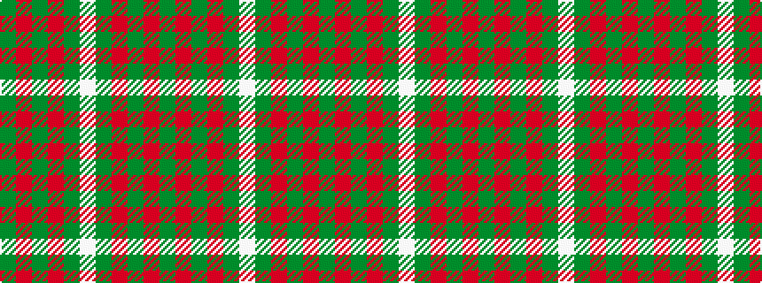

GRGRGWGRGRG

It is a 11 stripe tartan.

<figure class="pat-woven">

<figcaption>idealised sample</figcaption>
</figure>

## Colour Sequence



## Tartans with this colour sequence

| Tartans |
|---------------|
| [Brithwe Dewi Sant (Welsh)](/variants/s11/dg30r2dg8r1dg5w2dg5r1dg8r2dg30/)|
||
