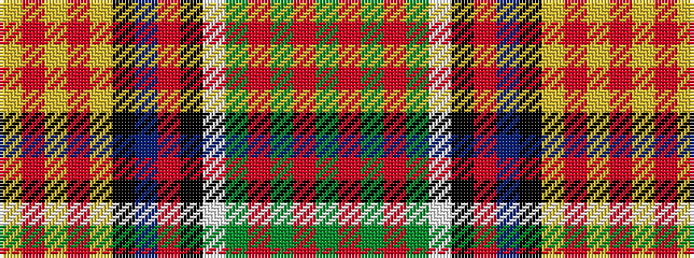

GRGRGWKRBKYRYRY

It is a 15 stripe tartan.

<figure class="pat-woven">

<figcaption>idealised sample</figcaption>
</figure>

## Colour Sequence



## Tartans with this colour sequence

| Tartans |
|---------------|
| [Esteba-Quer (Personal)](/setts/s15/g10r2g2r3g11lb2k10r2db12k1lo2r2lo2r2lo2~x2/)|
||
