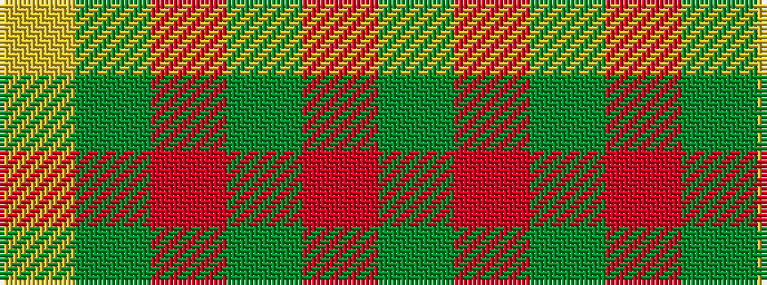

GRGRGY

It is a 6 stripe tartan.

<figure class="pat-woven">

<figcaption>idealised sample</figcaption>
</figure>

## Colour Sequence



## Tartans with this colour sequence

| Tartans |
|---------------|
| [O'Neill, Red](/setts/s6/g46o20g9o20g46lg5~x2/)|
||
