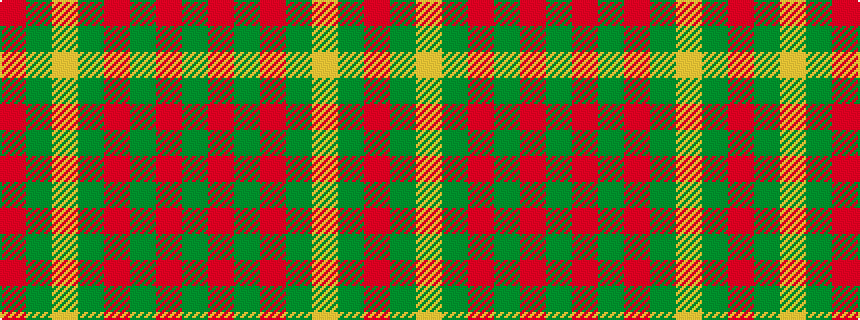

GRGRGYGR

It is a 8 stripe tartan.

<figure class="pat-woven">

<figcaption>idealised sample</figcaption>
</figure>

## Colour Sequence



## Tartans with this colour sequence

| Tartans |
|---------------|
| [Burnett](/variants/s8/r4g14ly3g14r4g3r29y4~x2/)|
||
