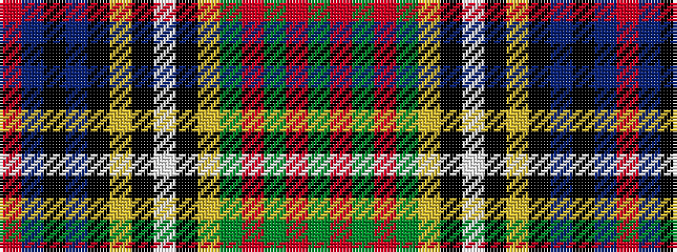

GRGRGYKWKYKBKBR

It is a 15 stripe tartan.

<figure class="pat-woven">

<figcaption>idealised sample</figcaption>
</figure>

## Colour Sequence



## Tartans with this colour sequence

| Tartans |
|---------------|
| [Wilson's No 181, (Stewart)](/setts/s15/r25t9k2t9k19ly3k3w5k3ly3g22r16g3r3g3~x2/)|
||
