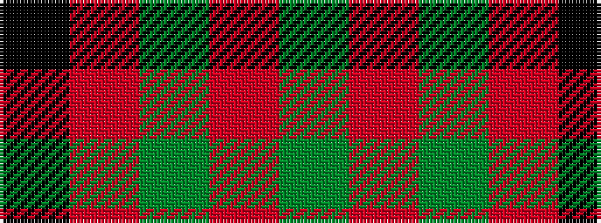

GRGRK

It is a 5 stripe tartan.

<figure class="pat-woven">

<figcaption>idealised sample</figcaption>
</figure>

## Colour Sequence



## Tartans with this colour sequence

| Tartans |
|---------------|
| [MacDonald Lord of the Isles #2](/setts/s5/dg16r5dg2r18k2~x2/)|
||
| [MacDonald of Sleat](/setts/s5/dg7r3dg1r9k1~x2/)|
||
| [MacDonald of Sleat](/setts/s5/dg16r5dg2r18k2/)|
||
| [MacDonald, Lord of The Isles (Artef)](/setts/s5/g16r5g2r18k2~x2/)|
||
| [Murray, Lord George (Hose)](/setts/s5/k1r5g10r5g1~x4/)|
||
