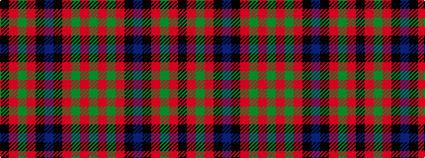

GRGRKBKRGRK

It is a 11 stripe tartan.

<figure class="pat-woven">

<figcaption>idealised sample</figcaption>
</figure>

## Colour Sequence



## Tartans with this colour sequence

| Tartans |
|---------------|
| [MacNichol](/variants/s11/k2r8g2r8k8db1k4r2g12r8g2~x2/)|
||
| [MacNicol Dress (Clan) (Smiths)](/variants/s11/k2r8g2r8k8b1k4r2g12r8g2~x4/)|
||
| [MacNicol/Nicolson (W & A Smith)](/variants/s11/k2r8dg2r8k8db1k4r2dg12r8dg2~x2/)|
||
