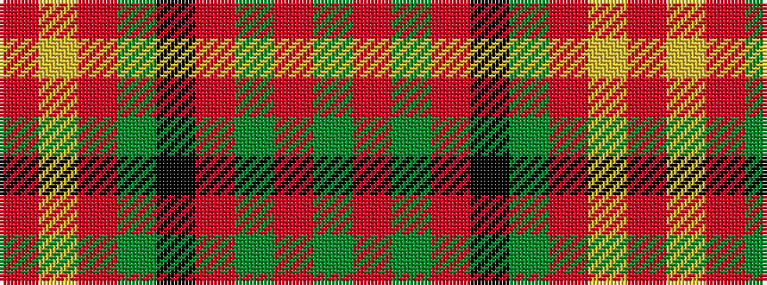

GRGRKGRYR

It is a 9 stripe tartan.

<figure class="pat-woven">

<figcaption>idealised sample</figcaption>
</figure>

## Colour Sequence



## Tartans with this colour sequence

| Tartans |
|---------------|
| [Justerini & Brooks](/variants/s9/r48ly14r9gi14k6r11g6r10gi3~x2/)|
||
