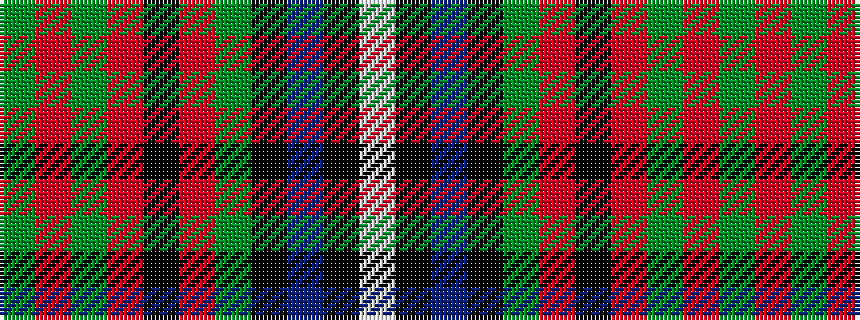

GRGRKRGKBKW

It is a 11 stripe tartan.

<figure class="pat-woven">

<figcaption>idealised sample</figcaption>
</figure>

## Colour Sequence



## Tartans with this colour sequence

| Tartans |
|---------------|
| [Zambia](/variants/s11/w4k1db16k1dg32r6k6o6dg4o2dg1~x2/)|
||
