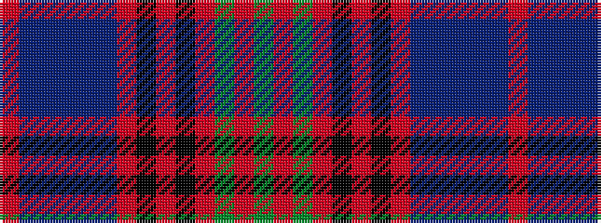

GRGRKRKRBBBBBR

It is a 14 stripe tartan.

<figure class="pat-woven">

<figcaption>idealised sample</figcaption>
</figure>

## Colour Sequence



## Tartans with this colour sequence

| Tartans |
|---------------|
| [Lochcarron Dress](/setts/s14/r3db10n3db2n2db2r3k5r2k5r22dg2r3dg2~x2/)|
||
