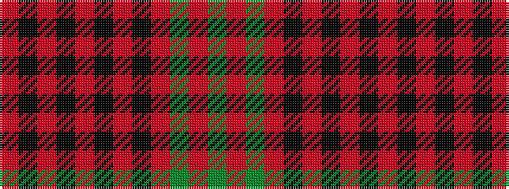

GRGRKRKRKRKR

It is a 12 stripe tartan.

<figure class="pat-woven">

<figcaption>idealised sample</figcaption>
</figure>

## Colour Sequence



## Tartans with this colour sequence

| Tartans |
|---------------|
| [Walker, Evening (Name)](/variants/s12/o4k2r7k15r3k3r3k7r28dg7r6dg2~x2/)|
||
