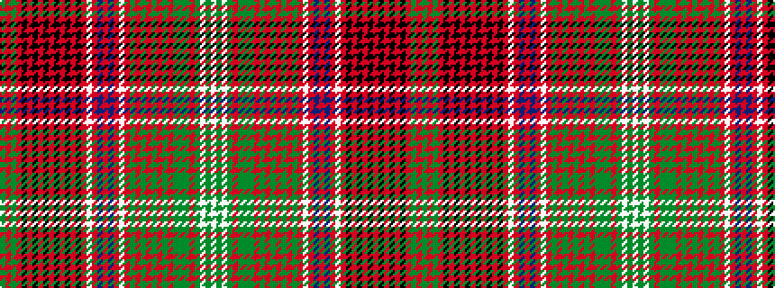

GRGRKRKRKRKRKRKRWRBRBRWRGRGRGRGRGGGRGWGW

It is a 40 stripe tartan.

<figure class="pat-woven">

<figcaption>idealised sample</figcaption>
</figure>

## Colour Sequence



## Tartans with this colour sequence

| Tartans |
|---------------|
| [Kinnoull (MacRae)](/variants/s40/dg24r7dg24r26k2r2k5r2k2r26k2r2k5r2k2r26w3r12db33r7db33r12w3r26dg4r12dg4r26dg12r8dg12r12dg8g7dg8r12dg9w3dg16w2~x2/)|
||
