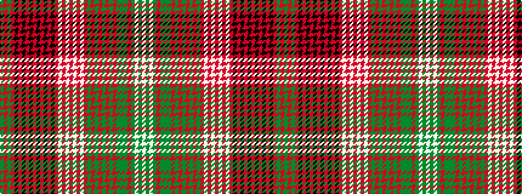

GRGRKRKRKRKRKRKRWRWRWRWRGRGRGRGRGGGRGWGW

It is a 40 stripe tartan.

<figure class="pat-woven">

<figcaption>idealised sample</figcaption>
</figure>

## Colour Sequence



## Tartans with this colour sequence

| Tartans |
|---------------|
| [Kinnoull (Clan)](/variants/s40/dg23r6dg23r25k2r2k5r2k2r26k2r2k5r2k2r26w3r12lb33r7lb33r12w3r26dg8r12dg4r26dg12r8dg12r12dg8y7dg8r12dg9w3dg16w2/)|
||
