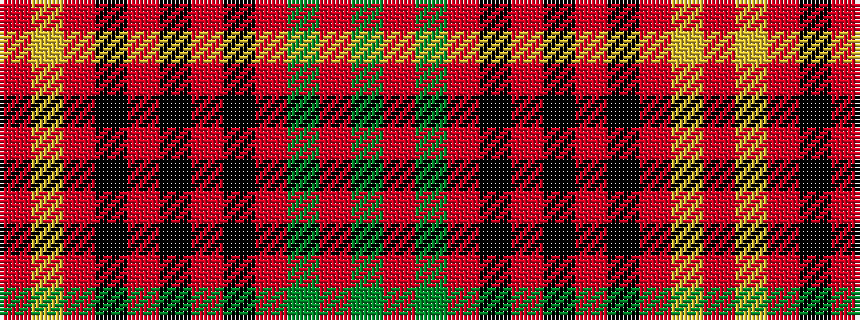

GRGRKRKRKRYR

It is a 12 stripe tartan.

<figure class="pat-woven">

<figcaption>idealised sample</figcaption>
</figure>

## Colour Sequence



## Tartans with this colour sequence

| Tartans |
|---------------|
| [Scotland's People](/variants/s12/r7ly3r27k14m5k3m5k3m8g3m4g4~x2/)|
||
