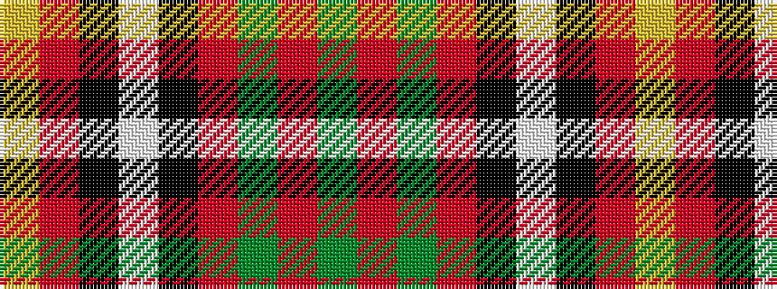

GRGRKWKRY

It is a 9 stripe tartan.

<figure class="pat-woven">

<figcaption>idealised sample</figcaption>
</figure>

## Colour Sequence



## Tartans with this colour sequence

| Tartans |
|---------------|
| [Akins Red Dress](/variants/s9/g6r4g5r13k13w5k13r13ly6~x2/)|
||
