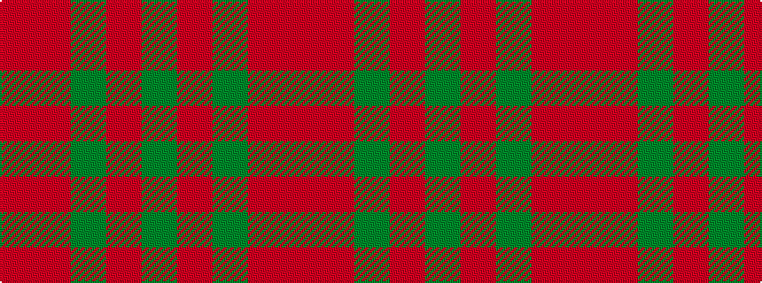

GRGRR

It is a 5 stripe tartan.

<figure class="pat-woven">

<figcaption>idealised sample</figcaption>
</figure>

## Colour Sequence



## Tartans with this colour sequence

| Tartans |
|---------------|
| [Glen Trool](/variants/s5/dg37o9dg3r9o3~x2/)|
||
| [Glen Trool (Fashion)](/variants/s5/dg42o10dg3r10o3~x2/)|
||
