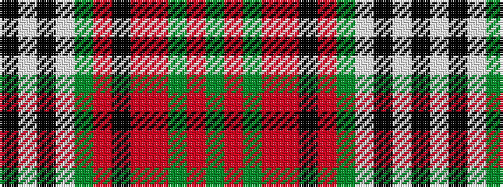

GRGRRKRGWKWK

It is a 12 stripe tartan.

<figure class="pat-woven">

<figcaption>idealised sample</figcaption>
</figure>

## Colour Sequence



## Tartans with this colour sequence

| Tartans |
|---------------|
| [Allandale Red Dress Tartan Tartan Number: 8457. Earliest known date: Threadcount and colours aren't 100% original. Generated manually. See products available Copyright © Blair Urquhart, Comrie, 2015](/setts/s12/k3w2k1w40g17r5k3o2r9g1r2g3~x2/)|
||
