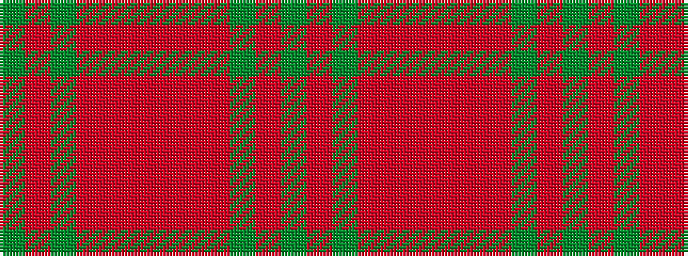

GRGRRRRRRGRG

It is a 12 stripe tartan.

<figure class="pat-woven">

<figcaption>idealised sample</figcaption>
</figure>

## Colour Sequence



## Tartans with this colour sequence

| Tartans |
|---------------|
| [78th Highlanders (Fraser) (Mil.)](/variants/s12/dg26r2dg2r2r19r28r3r28r19dg22r2dg2~x2/)|
||
