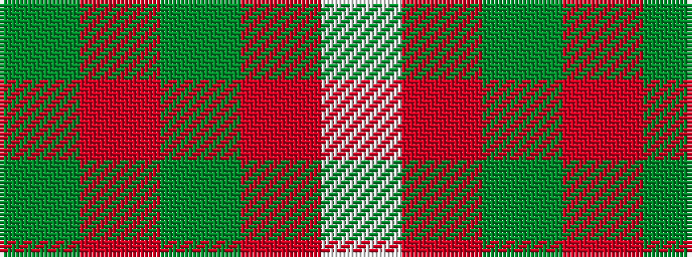

GRGRW

It is a 5 stripe tartan.

<figure class="pat-woven">

<figcaption>idealised sample</figcaption>
</figure>

## Colour Sequence



## Tartans with this colour sequence

| Tartans |
|---------------|
| [MacGregor of Balquhidder](/setts/s5/dg8r2dg9r16w1~x2/)|
||
| [Unidentified Plaid #3](/setts/s5/dg24r3dg16r33w4/)|
||
