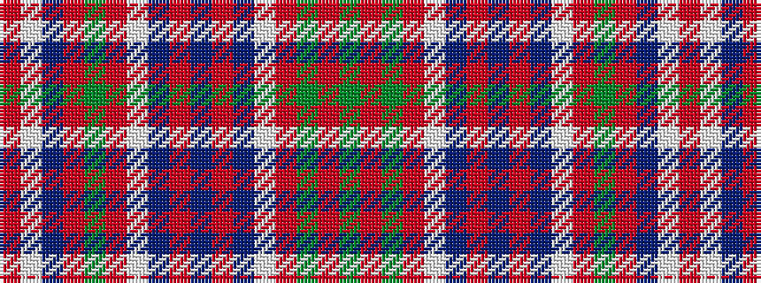

GRGRWBRBRBWRGRBWR

It is a 17 stripe tartan.

<figure class="pat-woven">

<figcaption>idealised sample</figcaption>
</figure>

## Colour Sequence



## Tartans with this colour sequence

| Tartans |
|---------------|
| [MacDonald of Lochmaddy](/variants/s17/r13w1t2r2g14r2w1t2r2db4r2t2w1r16g1r2g3~x2/)|
||
