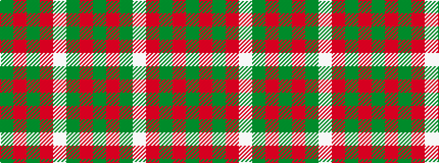

GRGRWGRG

It is a 8 stripe tartan.

<figure class="pat-woven">

<figcaption>idealised sample</figcaption>
</figure>

## Colour Sequence



## Tartans with this colour sequence

| Tartans |
|---------------|
| [Bannockbane Hunting (MacBean and Bishop)](/variants/s8/dg3o2dg14o1w10y14o2y3~x2/)|
||
| [Bannockbane, hunting](/variants/s8/g2o2g15o1w1g15o2g2~x2/)|
||
