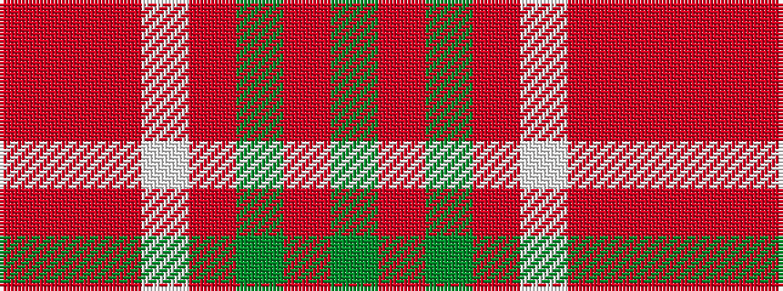

GRGRWRRR

It is a 8 stripe tartan.

<figure class="pat-woven">

<figcaption>idealised sample</figcaption>
</figure>

## Colour Sequence



## Tartans with this colour sequence

| Tartans |
|---------------|
| [Bannockbane, Grey](/variants/s8/o2oi2o15w10oi2y15oi2y2~x2/)|
||
