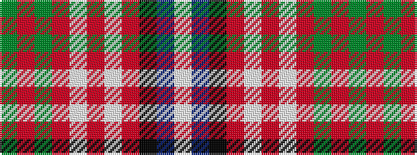

GRGRWRWRKBW

It is a 11 stripe tartan.

<figure class="pat-woven">

<figcaption>idealised sample</figcaption>
</figure>

## Colour Sequence



## Tartans with this colour sequence

| Tartans |
|---------------|
| [Hynde (Sir John)](/variants/s11/g28r2g28r7lb2r7lb2r7k5dp4lb2~x2/)|
||
| [Hynde (Sir John) (Artefact)](/variants/s11/g14r1g14r7lb1r7lb1r7k5dp3lb1~x4/)|
||
