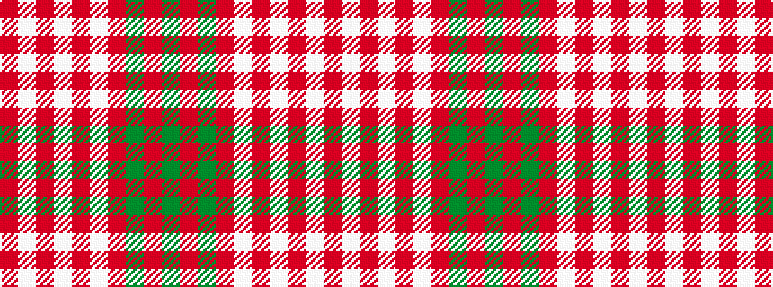

GRGRWRWRWR

It is a 10 stripe tartan.

<figure class="pat-woven">

<figcaption>idealised sample</figcaption>
</figure>

## Colour Sequence



## Tartans with this colour sequence

| Tartans |
|---------------|
| [Queen Alexandra](/variants/s10/r4w8r3w2r3w2r21g2r2g4~x2/)|
||
