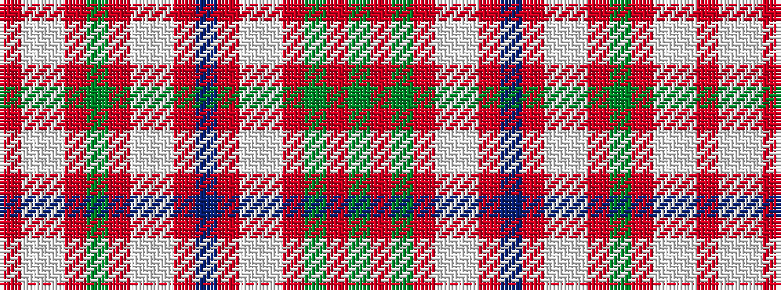

GRGRWWRBRWWRGRWWR

It is a 17 stripe tartan.

<figure class="pat-woven">

<figcaption>idealised sample</figcaption>
</figure>

## Colour Sequence



## Tartans with this colour sequence

| Tartans |
|---------------|
| [MacDonald of Lochmaddy](/setts/s17/r13w1lt2r2dg14r2w1lt2r2db4r2lt2w1r16dg1r2dg3~x2/)|
||
