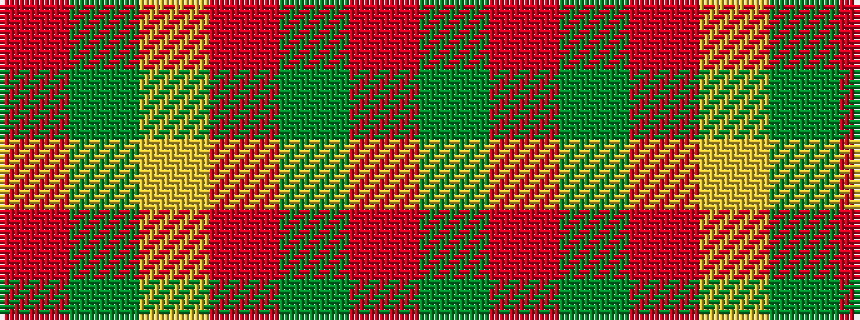

GRGRYGR

It is a 7 stripe tartan.

<figure class="pat-woven">

<figcaption>idealised sample</figcaption>
</figure>

## Colour Sequence



## Tartans with this colour sequence

| Tartans |
|---------------|
| [Green Watch](/setts/s7/dg10o1dg1o1lr2dg1o1~x4/)|
||
