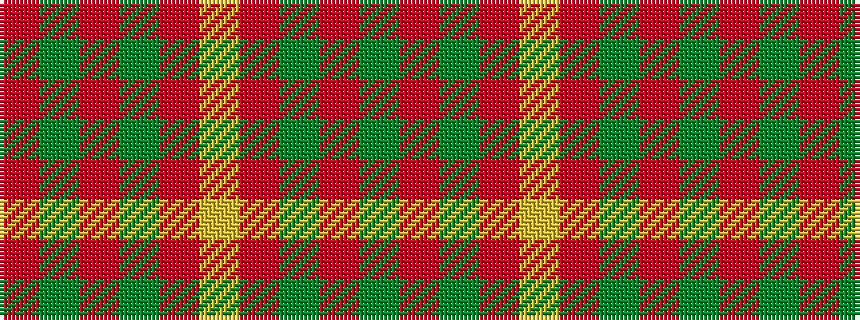

GRGRYRGRGR

It is a 10 stripe tartan.

<figure class="pat-woven">

<figcaption>idealised sample</figcaption>
</figure>

## Colour Sequence



## Tartans with this colour sequence

| Tartans |
|---------------|
| [Maguire Clan Family Tartan Tartan Number: 6812. Earliest known date: 2005 The first Scottish Maguire as recorded with Lord Lyon. The design is based on MacQuarrie and was created by FE Maguire at the House of Tartan in Comrie, Perthshire. The tartan is intended for the use of all Scottish Maguires. See products available Copyright © Blair Urquhart, Comrie, 2015](/setts/s10/o29g2o2g2o6ly21~x4/)|
||
