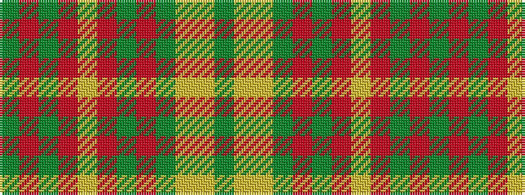

GRGRYRGRGYYG

It is a 12 stripe tartan.

<figure class="pat-woven">

<figcaption>idealised sample</figcaption>
</figure>

## Colour Sequence



## Tartans with this colour sequence

| Tartans |
|---------------|
| [Maple Leaf](/setts/s12/dg19r3dg3r15lo13r15dg3r3dg19ly6lo6dy6~x2/)|
||
