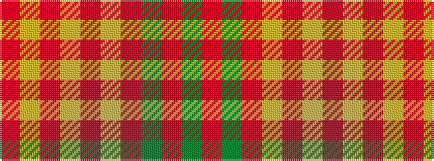

GRGRYRYRYR

It is a 10 stripe tartan.

<figure class="pat-woven">

<figcaption>idealised sample</figcaption>
</figure>

## Colour Sequence



## Tartans with this colour sequence

| Tartans |
|---------------|
| [Queen Alexandra](/setts/s10/dg4r2dg2r16lr2r3lr2r3lr8r3~x2/)|
||
| [Queen Alexandra (Fashion)](/setts/s10/dg4r2dg2r16lr2r3lr2r3lr8r3~x4/)|
||
