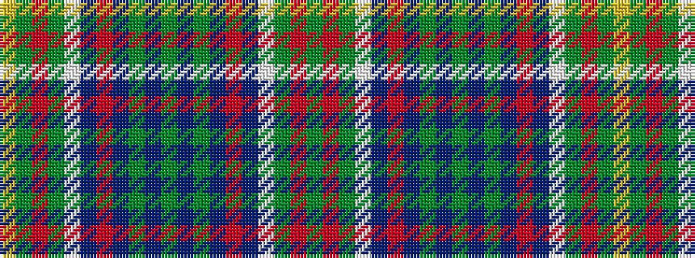

GRGWBRBGBGBGBRBWGRGY

It is a 20 stripe tartan.

<figure class="pat-woven">

<figcaption>idealised sample</figcaption>
</figure>

## Colour Sequence



## Tartans with this colour sequence

| Tartans |
|---------------|
| [Hunter of Hunterston](/setts/s20/g4r2g14w2db14r2db14g14db2g5db2g14db14r2db14w2g14r2g4ly3~x2/)|
||
